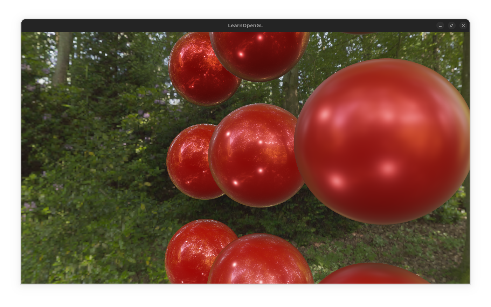
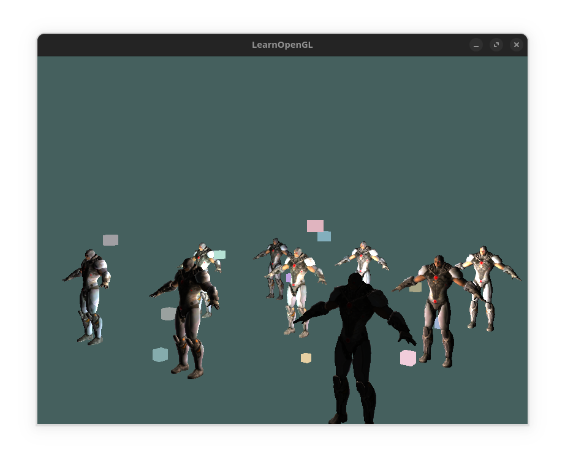
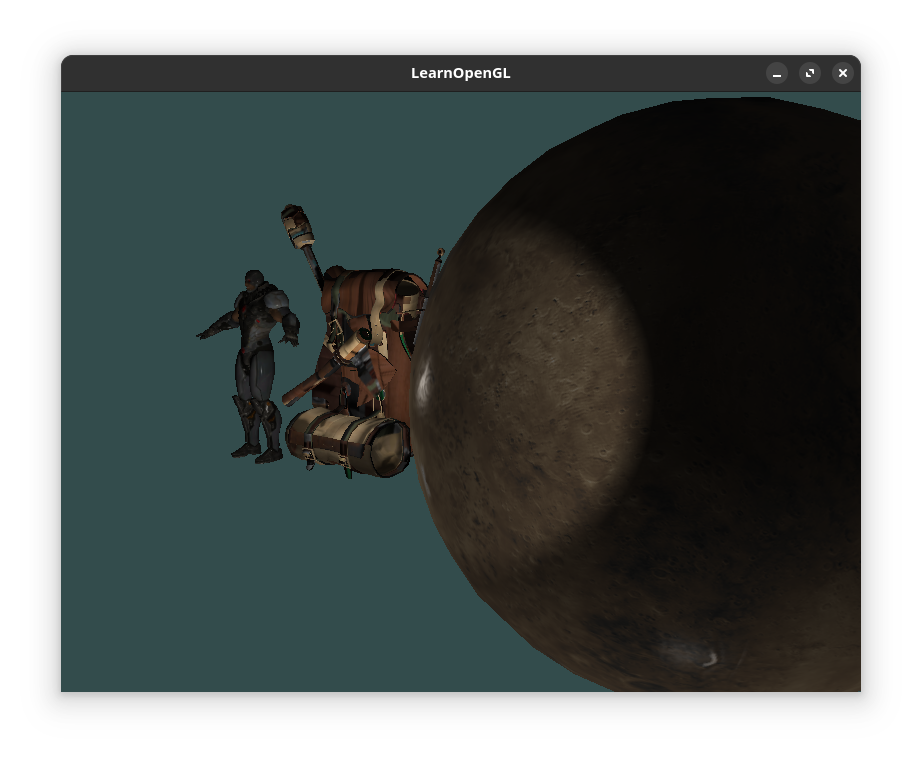
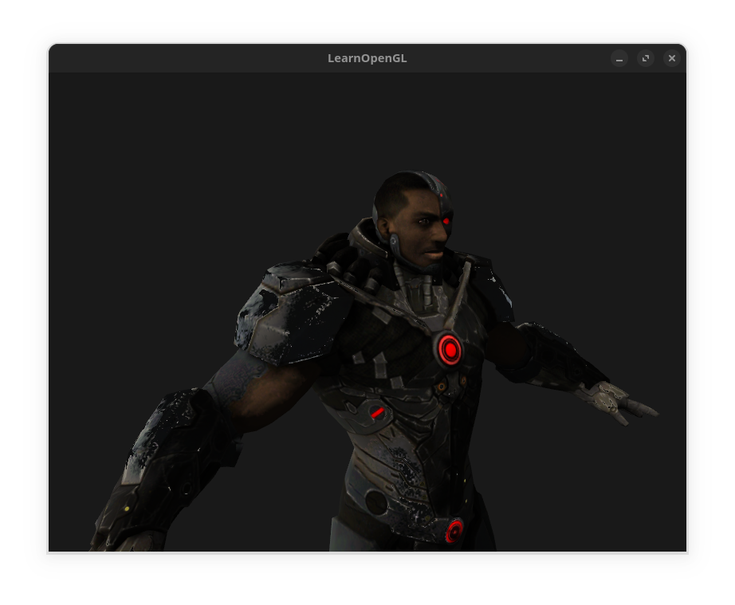
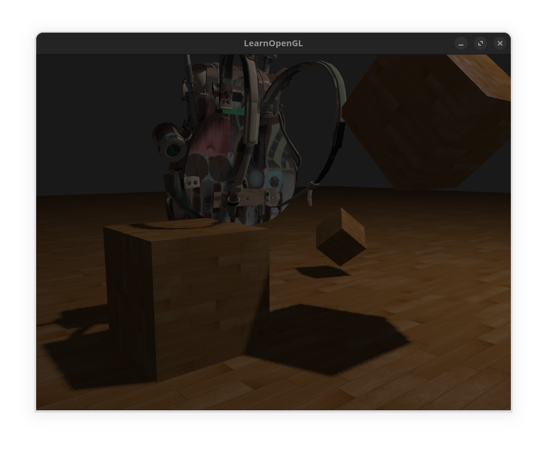
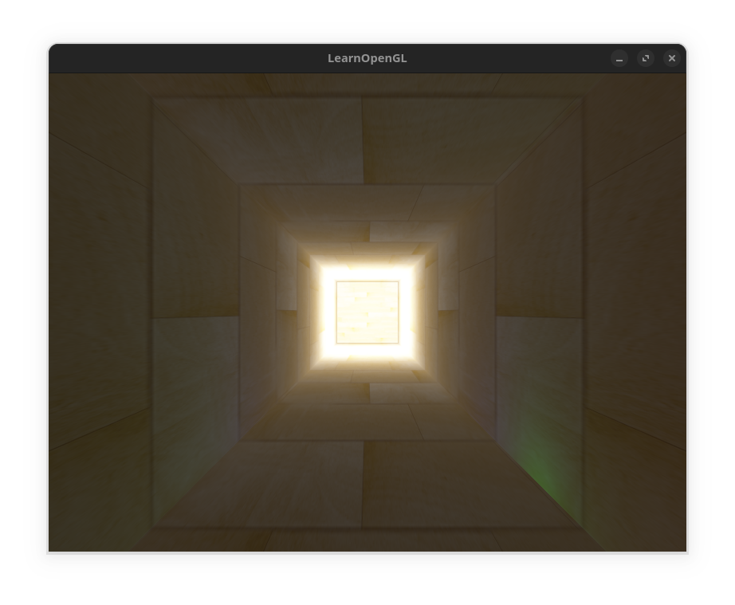
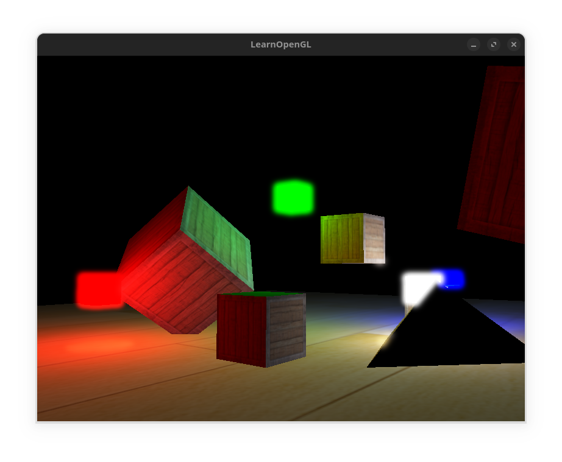
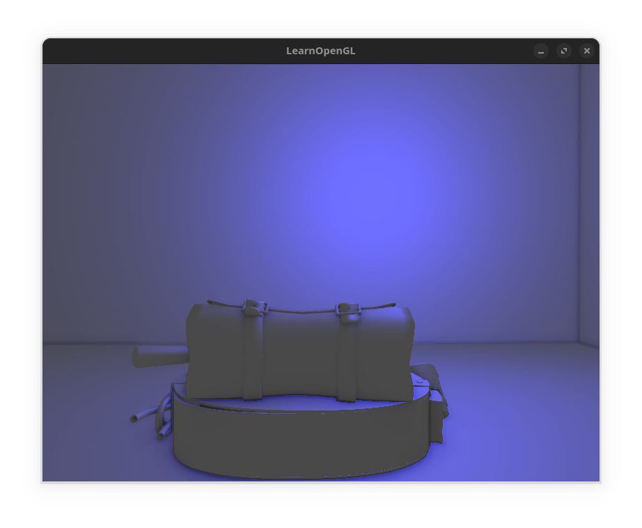

# OpenGL tests
Learning and playing with opengl based on the [LearnOpenGL](https://learnopengl.com/) book.

## PBR

Physically based rendering with specular image based lighting.

--- 

## Deferred shading

Deferred shading to render multiple lights in a scene.

---

## Models
Loading .obj files with `assimp` library.

---

## Normal mapping

---

## Shadow mapping

---

## HDR

---

## Bloom

---

## SSAO
Screen space ambient occlusion

---